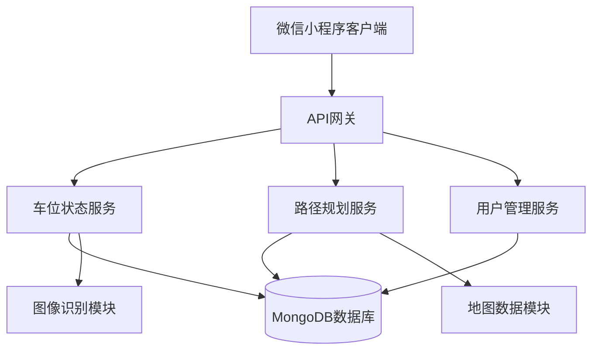
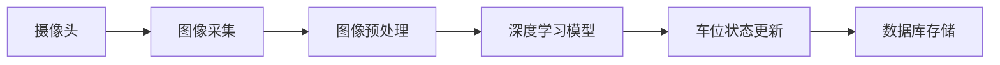
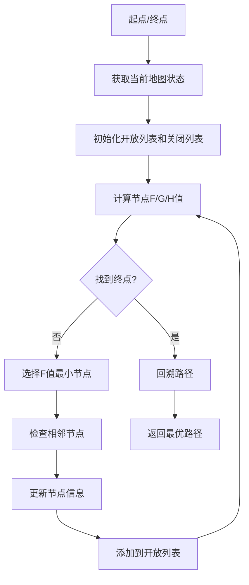
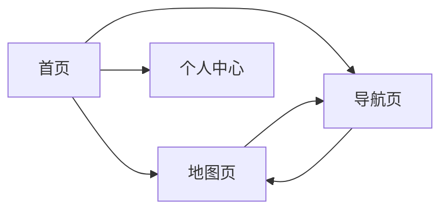

# 智能停车场车位引导与智能导航系统设计文档

## 1. 概述

### 1.1 项目背景
随着城市化进程加快，停车难问题日益突出。传统停车场缺乏有效的车位引导和导航系统，导致驾驶员寻找车位时间长、停车场利用率低。本项目旨在开发一套基于微信小程序的智能停车场车位引导与导航系统，通过图像识别和深度学习技术提高车位状态识别准确率，结合动态路径规划算法，为用户提供高效、便捷的停车体验。

### 1.2 项目目标
- 实现车位状态的实时准确监测（准确率95%以上）
- 开发能够实时调整并给出最优路径的动态路径规划算法
- 设计友好的用户界面，简化用户操作流程
- 系统响应时间不超过3秒
- 用户满意度调查得分不低于85分

### 1.3 技术栈
- 前端：微信小程序原生开发
- 后端：Node.js + Express
- 数据库：MongoDB
- 图像识别：OpenCV + TensorFlow.js
- 路径规划：A*算法改进版
- 地图可视化：微信小程序地图组件

## 2. 系统架构

### 2.1 整体架构

### 2.2 模块划分
1. **用户界面模块**：提供车位查询、导航引导、用户设置等功能
2. **车位状态模块**：负责车位状态检测与更新
3. **路径规划模块**：计算最优路径并实时调整
4. **地图展示模块**：可视化停车场布局和导航路线
5. **用户管理模块**：处理用户注册、登录、偏好设置等

## 3. 核心功能设计

### 3.1 车位状态识别
#### 3.1.1 技术方案
- 使用摄像头采集停车场图像
- 应用深度学习模型识别车位占用状态
- 结合OpenCV进行图像预处理

#### 3.1.2 数据流程

### 3.2 动态路径规划
#### 3.2.1 算法设计
- 基于A*算法改进，考虑动态障碍物
- 实时更新路径以应对临时变化
- 多目标优化：距离最短、时间最少、安全性最高

#### 3.2.2 算法流程

### 3.3 用户界面设计
#### 3.3.1 主要页面
1. **首页**：显示停车场概览、空闲车位数
2. **地图页**：显示停车场地图和车位状态
3. **导航页**：提供路径导航和实时引导
4. **个人中心**：用户设置和历史记录

#### 3.3.2 界面原型

## 4. 数据模型设计

### 4.1 用户模型 (User)
| 字段 | 类型 | 描述 |
|------|------|------|
| userId | String | 用户唯一标识 |
| openid | String | 微信用户标识 |
| nickname | String | 用户昵称 |
| avatar | String | 用户头像 |
| createdAt | Date | 创建时间 |

### 4.2 车位模型 (ParkingSpace)
| 字段 | 类型 | 描述 |
|------|------|------|
| spaceId | String | 车位唯一标识 |
| position | Object | 车位坐标 {x, y} |
| status | Enum | 车位状态 (空闲/占用/预定) |
| updatedAt | Date | 最后更新时间 |

### 4.3 路径模型 (Path)
| 字段 | 类型 | 描述 |
|------|------|------|
| pathId | String | 路径唯一标识 |
| startPoint | Object | 起点坐标 |
| endPoint | Object | 终点坐标 |
| route | Array | 路径节点数组 |
| distance | Number | 路径距离 |
| estimatedTime | Number | 预估时间 |

## 5. API接口设计

### 5.1 车位相关接口
#### 获取车位状态
- 接口：`GET /api/spaces`
- 参数：`parkingId` (停车场ID)
- 返回：车位状态列表

#### 更新车位状态
- 接口：`POST /api/spaces/update`
- 参数：`spaceId`, `status`
- 返回：更新结果

### 5.2 路径规划接口
#### 计算最优路径
- 接口：`POST /api/path/plan`
- 参数：`startPoint`, `endPoint`, `obstacles`
- 返回：最优路径信息

#### 实时路径调整
- 接口：`POST /api/path/adjust`
- 参数：`pathId`, `newObstacles`
- 返回：调整后的路径

### 5.3 用户相关接口
#### 用户登录
- 接口：`POST /api/user/login`
- 参数：`code` (微信登录凭证)
- 返回：用户信息和token

#### 获取用户信息
- 接口：`GET /api/user/info`
- 参数：`userId`
- 返回：用户详细信息

## 6. 算法设计

### 6.1 车位识别算法
#### 深度学习模型
- 模型类型：卷积神经网络(CNN)
- 输入：停车场图像
- 输出：每个车位的占用状态
- 准确率目标：≥95%

#### 图像处理流程
1. 图像采集与预处理
2. 车位区域定位
3. 占用状态分类
4. 结果后处理与优化

### 6.2 路径规划算法
#### 改进A*算法
- 启发函数：考虑距离和动态障碍物
- 代价函数：综合距离、时间、安全性
- 动态更新：实时响应环境变化

#### 算法优化
- 预处理地图信息，建立路网拓扑
- 使用优先队列优化节点选择
- 缓存历史路径减少重复计算

## 7. 性能优化策略

### 7.1 响应时间优化
- 使用Redis缓存热点数据
- 数据库索引优化
- 接口响应压缩
- 异步处理非关键任务

### 7.2 识别准确率优化
- 多帧图像融合判断
- 历史状态平滑处理
- 异常状态人工审核机制
- 模型持续训练优化

### 7.3 用户体验优化
- 地图预加载和缓存
- 路径引导语音提示
- 界面响应式设计
- 操作流程简化

## 8. 安全性设计

### 8.1 数据安全
- 用户敏感信息加密存储
- API接口身份验证
- 数据传输HTTPS加密
- 数据库访问权限控制

### 8.2 系统安全
- 防止SQL注入和XSS攻击
- 接口访问频率限制
- 异常请求监控和拦截
- 系统日志记录和审计

## 9. 测试策略

### 9.1 单元测试
- 车位识别算法测试
- 路径规划算法测试
- API接口功能测试
- 数据库操作测试

### 9.2 集成测试
- 前后端数据交互测试
- 第三方服务集成测试
- 微信小程序功能测试

### 9.3 性能测试
- 系统响应时间测试
- 并发用户访问测试
- 图像识别准确率测试
- 路径规划效率测试

### 9.4 用户验收测试
- 用户界面易用性测试
- 功能完整性验证
- 用户满意度调查
- 实际场景应用测试

## 10. 部署方案

### 10.1 前端部署
- 微信小程序代码审核发布
- 静态资源CDN加速
- 多版本灰度发布

### 10.2 后端部署
- Docker容器化部署
- Nginx负载均衡
- MongoDB集群部署
- 监控和日志系统

### 10.3 运维监控
- 系统性能监控
- 错误日志收集
- 用户行为分析
- 自动化告警机制