# TCC 智能停车场系统 - 数据库 ER 图

## 系统架构概述

本系统包含两大模块：
1. **后台管理系统** - 管理员、停车场、停车位、交易等管理
2. **微信小程序** - 用户端、车辆管理、停车记录等

---

## 实体关系图 (ER Diagram)

```mermaid
erDiagram

    %% ============ 基础用户模块 ============
    
    Role ||--o{ User : "分配"
    User {
        ObjectId id PK
        string username UK
        string email UK
        string password
        string name
        string avatar
        string phone
        ObjectId role FK
        string status
        Date lastLogin
    }
    
    Role {
        ObjectId id PK
        string name UK
        string description
        array permissions
        boolean isDefault
    }
    
    Admin ||--o{ Transaction : "处理"
    Admin ||--o{ SystemConfig : "更新"
    Admin ||--o{ NavigationPath : "创建"
    Admin ||--o{ AnalyticsReport : "生成"
    Admin {
        ObjectId id PK
        string username UK
        string email UK
        string password
        string name
        string avatar
        string role
        array permissions
        string status
        Date lastLogin
    }

    %% ============ 停车场核心模块 ============
    
    ParkingLot ||--o{ ParkingSpace : "拥有"
    ParkingLot ||--o{ MapNode : "包含"
    ParkingLot ||--o{ NavigationPath : "关联"
    ParkingLot ||--o{ Transaction : "记录交易"
    ParkingLot ||--o{ PricingRule : "设置定价"
    ParkingLot {
        ObjectId id PK
        string name
        string address
        string description
        int totalSpaces
        array floors
        object operatingHours
        array facilities
        object contact
        string status
    }
    
    ParkingSpace ||--o| MapNode : "位于节点"
    ParkingSpace ||--o{ Transaction : "关联交易"
    ParkingSpace {
        ObjectId id PK
        string spaceId UK
        string floorId
        ObjectId lotId FK
        string area
        string type
        string status
        object position
        ObjectId currentNode FK
        Date lastUpdated
        object occupiedBy
    }
    
    %% ============ 地图导航模块 ============
    
    MapNode ||--o{ NavigationPath : "作为起点"
    MapNode ||--o{ NavigationPath : "作为终点"
    MapNode ||--o{ ParkingSpace : "关联车位"
    MapNode ||--o| ParkingLot : "属于停车场"
    MapNode {
        ObjectId id PK
        string nodeId
        string floorId
        ObjectId lotId FK
        string type
        object position
        array connections
        boolean isAccessible
        string name
        string description
    }
    
    NavigationPath {
        ObjectId id PK
        string pathId UK
        string name
        string description
        ObjectId lotId FK
        ObjectId startNode FK
        ObjectId endNode FK
        array nodes
        float totalDistance
        int totalTime
        string pathType
        boolean isActive
        ObjectId createdBy FK
    }

    %% ============ 交易计费模块 ============
    
    PricingRule ||--o{ Transaction : "应用于"
    PricingRule ||--o| ParkingLot : "属于"
    PricingRule {
        ObjectId id PK
        string name
        string description
        ObjectId lotId FK
        array rules
        array specialRules
        boolean isActive
        Date effectiveDate
        Date expiryDate
    }
    
    Transaction ||--o| ParkingLot : "所属停车场"
    Transaction ||--o| ParkingSpace : "使用车位"
    Transaction ||--o| Admin : "处理人"
    Transaction ||--o| PricingRule : "使用规则"
    Transaction {
        ObjectId id PK
        string transactionId UK
        string type
        string userId
        string vehicleNumber
        ObjectId lotId FK
        ObjectId spaceId FK
        Date entryTime
        Date exitTime
        int duration
        float amount
        string paymentMethod
        string paymentStatus
        Date paymentTime
        ObjectId pricingRule FK
        array breakdown
        float discount
        float tax
        float totalAmount
        string notes
        ObjectId processedBy FK
    }

    %% ============ 系统配置模块 ============
    
    SystemConfig ||--o| Admin : "最后更新人"
    SystemConfig {
        ObjectId id PK
        string configKey UK
        mixed configValue
        string description
        string category
        string dataType
        boolean isEditable
        object validationRules
        ObjectId lastUpdatedBy FK
    }

    %% ============ 分析报表模块 ============
    
    AnalyticsReport ||--o| ParkingLot : "分析对象"
    AnalyticsReport ||--o| User : "生成者"
    AnalyticsReport {
        ObjectId id PK
        string name
        string type
        ObjectId parkingLotId FK
        object period
        object data
        ObjectId generatedBy FK
        boolean isScheduled
        object schedule
    }

    %% ============ 模拟历史模块 ============
    
    SimulationHistory ||--o| ParkingSpace : "模拟对象"
    SimulationHistory ||--o| User : "模拟者"
    SimulationHistory {
        ObjectId id PK
        ObjectId parkingSpaceId FK
        string previousStatus
        string newStatus
        ObjectId simulatedBy FK
        string simulationType
    }

    %% ============ 微信小程序模块 ============
    
    MiniProgramUser ||--o{ Vehicle : "绑定车辆"
    MiniProgramUser ||--o{ ParkingRecord : "停车记录"
    MiniProgramUser ||--o{ FavoriteParkingLot : "收藏"
    MiniProgramUser ||--o{ UserFeedback : "反馈"
    MiniProgramUser {
        ObjectId id PK
        string openId UK
        string unionId
        string nickName
        string avatarUrl
        int gender
        string phone
        boolean isGuest
        boolean isActive
        Date lastLoginTime
        int loginCount
        int totalParkingCount
        object statistics
    }
    
    Vehicle ||--o| MiniProgramUser : "所属用户"
    Vehicle ||--o{ ParkingRecord : "停车车辆"
    Vehicle {
        ObjectId id PK
        ObjectId userId FK
        string licensePlate
        string vehicleType
        string brand
        string model
        string color
        boolean isDefault
        boolean isActive
    }
    
    ParkingRecord ||--o| MiniProgramUser : "所属用户"
    ParkingRecord ||--o| Vehicle : "使用车辆"
    ParkingRecord ||--o| ParkingLot : "停车场"
    ParkingRecord ||--o| ParkingSpace : "停车位"
    ParkingRecord ||--o| NavigationPath : "导航路径"
    ParkingRecord {
        ObjectId id PK
        ObjectId userId FK
        ObjectId vehicleId FK
        ObjectId parkingLotId FK
        ObjectId spaceId FK
        Date entryTime
        Date exitTime
        Date plannedExitTime
        string status
        object fee
        object navigationPath
        object findCarPath
        string notes
    }
    
    FavoriteParkingLot ||--o| MiniProgramUser : "所属用户"
    FavoriteParkingLot ||--o| ParkingLot : "收藏停车场"
    FavoriteParkingLot {
        ObjectId id PK
        ObjectId userId FK
        ObjectId parkingLotId FK
        Date addedAt
    }
    
    UserFeedback ||--o| MiniProgramUser : "提交用户"
    UserFeedback {
        ObjectId id PK
        ObjectId userId FK
        string type
        string content
        array images
        string contactInfo
        string status
        string adminReply
        Date resolvedAt
    }
```



---

## 表结构详细说明

### 1. 用户角色模块

| 表名 | 说明 | 主要字段 |
|------|------|----------|
| **User** | 后台系统用户 | username, email, password, name, role |
| **Role** | 用户角色 | name, description, permissions |
| **Admin** | 独立管理员表 | username, password, name, role, permissions |

### 2. 停车场管理模块

| 表名 | 说明 | 主要字段 |
|------|------|----------|
| **ParkingLot** | 停车场 | name, address, totalSpaces, floors, pricingRules |
| **ParkingSpace** | 停车位 | spaceId, floorId, lotId, type, status, position |
| **MapNode** | 地图节点 | nodeId, floorId, lotId, type, position, connections |

### 3. 导航路径模块

| 表名 | 说明 | 主要字段 |
|------|------|----------|
| **NavigationPath** | 导航路径 | pathId, lotId, startNode, endNode, nodes, totalDistance |

### 4. 交易计费模块

| 表名 | 说明 | 主要字段 |
|------|------|----------|
| **Transaction** | 交易记录 | transactionId, type, userId, amount, paymentStatus |
| **PricingRule** | 定价规则 | name, lotId, rules, specialRules, isActive |

### 5. 系统配置模块

| 表名 | 说明 | 主要字段 |
|------|------|----------|
| **SystemConfig** | 系统配置 | configKey, configValue, category, dataType |

### 6. 分析报表模块

| 表名 | 说明 | 主要字段 |
|------|------|----------|
| **AnalyticsReport** | 分析报告 | name, type, parkingLotId, period, data |
| **SimulationHistory** | 模拟历史 | parkingSpaceId, previousStatus, newStatus |

### 7. 微信小程序模块

| 表名 | 说明 | 主要字段 |
|------|------|----------|
| **MiniProgramUser** | 小程序用户 | openId, unionId, nickName, phone, statistics |
| **Vehicle** | 用户车辆 | userId, licensePlate, vehicleType, brand |
| **ParkingRecord** | 停车记录 | userId, vehicleId, parkingLotId, entryTime, fee |
| **FavoriteParkingLot** | 收藏停车场 | userId, parkingLotId, addedAt |
| **UserFeedback** | 用户反馈 | userId, type, content, status, adminReply |

---

## 实体关系总结

```
┌─────────────────────────────────────────────────────────────────┐
│                         ParkingLot                              │
│  (停车场 - 核心实体)                                              │
│    │                                                              │
│    ├──1:N──> ParkingSpace (停车位)                              │
│    │                                                              │
│    ├──1:N──> MapNode (地图节点)                                  │
│    │         └──1:N──> NavigationPath (导航路径)                 │
│    │                                                              │
│    ├──1:N──> Transaction (交易记录)                              │
│    │                                                              │
│    ├──1:N──> PricingRule (定价规则)                                │
│    │                                                              │
│    └──1:N──> FavoriteParkingLot (收藏)                           │
│              └──N:1──> MiniProgramUser                           │
│                                                                  │
└─────────────────────────────────────────────────────────────────┘
```

---

## 索引设计

| 表名 | 索引字段 |
|------|----------|
| User | username, email, role, status |
| Role | name |
| Admin | username, email |
| ParkingLot | - |
| ParkingSpace | spaceId, floorId, lotId, status |
| MapNode | nodeId+floorId, lotId, type |
| NavigationPath | pathId, lotId, startNode, endNode |
| Transaction | transactionId, userId, vehicleNumber, lotId, entryTime, paymentStatus |
| PricingRule | lotId, isActive |
| SystemConfig | configKey, category |
| MiniProgramUser | openId |
| Vehicle | userId |
| ParkingRecord | userId, vehicleId, parkingLotId |
| FavoriteParkingLot | userId, parkingLotId |
| UserFeedback | userId |

---

## 数据库技术栈

- **数据库**: MongoDB
- **ORM**: Mongoose
- **认证**: JWT + bcrypt
- **密码加密**: bcryptjs (salt rounds: 10)
