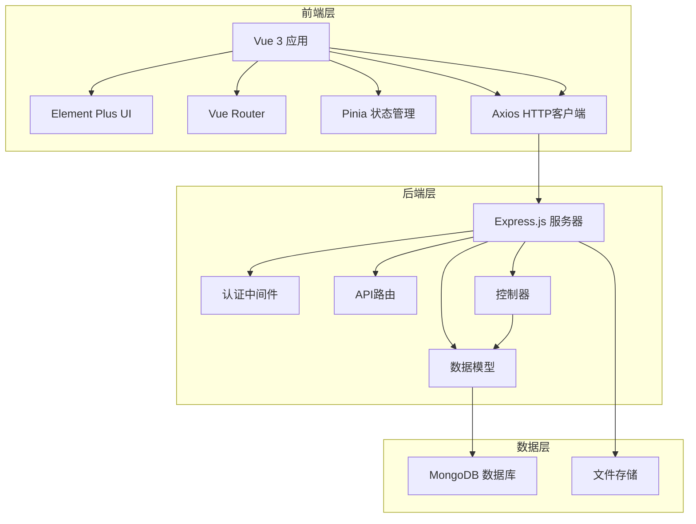

# 智能停车场后台管理系统架构设计

## 1. 系统概述

智能停车场后台管理系统是基于Vue 3 + Element Plus + Node.js的全栈管理系统，用于管理停车场、车位、用户、停车记录等数据，并提供数据分析和可视化功能。

## 2. 技术架构

### 2.1 前端技术栈
- **框架**: Vue 3 (Composition API)
- **UI组件库**: Element Plus
- **状态管理**: Pinia
- **路由管理**: Vue Router 4
- **HTTP客户端**: Axios
- **图表库**: ECharts + Vue-ECharts
- **地图组件**: Leaflet
- **构建工具**: Vite
- **样式预处理**: Sass

### 2.2 后端技术栈
- **运行环境**: Node.js
- **Web框架**: Express.js
- **数据库**: MongoDB
- **ODM**: Mongoose
- **身份认证**: JWT (JSON Web Token)
- **密码加密**: bcryptjs
- **API文档**: 自定义API文档

### 2.3 系统架构图



## 3. 功能模块设计

### 3.1 核心功能模块

1. **登录认证模块**
   - 管理员登录/登出
   - JWT令牌管理
   - 权限控制

2. **仪表盘模块**
   - 实时数据概览
   - 关键指标展示
   - 图表可视化

3. **停车场管理模块**
   - 停车场信息管理
   - 停车场增删改查
   - 停车场状态监控

4. **车位管理模块**
   - 车位信息管理
   - 车位状态监控
   - 车位批量操作

5. **用户管理模块**
   - 用户信息管理
   - 用户行为分析
   - 用户黑名单管理

6. **停车记录模块**
   - 停车记录查询
   - 停车费用管理
   - 异常记录处理

7. **数据分析模块**
   - 占用率分析
   - 收入分析
   - 用户行为分析
   - 报表生成

8. **系统配置模块**
   - 系统参数设置
   - 计费规则配置
   - 系统日志管理

### 3.2 页面结构设计

```
src/
├── api/                    # API接口封装
├── components/             # 公共组件
├── layout/                 # 布局组件
├── plugins/                # 插件配置
├── router/                 # 路由配置
├── stores/                 # 状态管理
├── utils/                  # 工具函数
└── views/                  # 页面组件
    ├── dashboard/           # 仪表盘
    ├── login/              # 登录页面
    ├── parking/            # 停车场管理
    ├── spaces/             # 车位管理
    ├── users/              # 用户管理
    ├── records/            # 停车记录
    ├── analytics/          # 数据分析
    └── system/             # 系统配置
```

## 4. 数据模型设计

### 4.1 核心数据模型

1. **管理员模型 (Admin)**
   - 用户名、密码、姓名、邮箱
   - 角色、权限、状态
   - 最后登录时间

2. **停车场模型 (ParkingLot)**
   - 名称、地址、描述
   - 总车位数、楼层信息
   - 营业时间、收费标准

3. **车位模型 (ParkingSpace)**
   - 车位编号、所在楼层、区域
   - 车位类型、状态
   - 关联停车场ID

4. **用户模型 (MiniProgramUser)**
   - 微信用户信息
   - 车辆信息、停车记录
   - 用户偏好设置

5. **停车记录模型 (ParkingRecord)**
   - 入场时间、出场时间
   - 停车费用、支付状态
   - 关联用户和车位

6. **交易记录模型 (Transaction)**
   - 交易金额、支付方式
   - 交易状态、交易时间
   - 关联停车记录

## 5. API接口设计

### 5.1 认证相关接口
- POST `/api/auth/login` - 管理员登录
- GET `/api/auth/info` - 获取当前用户信息
- POST `/api/auth/logout` - 登出
- PUT `/api/auth/change-password` - 修改密码

### 5.2 停车场管理接口
- GET `/api/parking/lots` - 获取停车场列表
- GET `/api/parking/lots/:id` - 获取停车场详情
- POST `/api/parking/lots` - 创建停车场
- PUT `/api/parking/lots/:id` - 更新停车场
- DELETE `/api/parking/lots/:id` - 删除停车场

### 5.3 车位管理接口
- GET `/api/parking/spaces` - 获取车位列表
- GET `/api/parking/spaces/:id` - 获取车位详情
- POST `/api/parking/spaces` - 创建车位
- PUT `/api/parking/spaces/:id` - 更新车位
- DELETE `/api/parking/spaces/:id` - 删除车位
- POST `/api/parking/spaces/batch` - 批量操作车位

### 5.4 用户管理接口
- GET `/api/users` - 获取用户列表
- GET `/api/users/:id` - 获取用户详情
- PUT `/api/users/:id` - 更新用户信息
- POST `/api/users/:id/blacklist` - 添加到黑名单
- DELETE `/api/users/:id/blacklist` - 从黑名单移除

### 5.5 停车记录接口
- GET `/api/records` - 获取停车记录列表
- GET `/api/records/:id` - 获取停车记录详情
- PUT `/api/records/:id` - 更新停车记录
- POST `/api/records/:id/settle` - 结算停车费用

### 5.6 数据分析接口
- GET `/api/analytics/dashboard/stats` - 获取仪表盘统计数据
- GET `/api/analytics/reports` - 获取分析报告列表
- POST `/api/analytics/reports` - 创建分析报告
- POST `/api/analytics/reports/generate/occupancy` - 生成占用率报告
- POST `/api/analytics/reports/generate/revenue` - 生成收入报告

### 5.7 系统配置接口
- GET `/api/system/configs` - 获取系统配置列表
- GET `/api/system/configs/:key` - 获取单个配置
- PUT `/api/system/configs/:key` - 更新配置
- DELETE `/api/system/configs/:key` - 删除配置
- POST `/api/system/configs/batch` - 批量更新配置

## 6. 权限控制设计

### 6.1 角色定义
- **超级管理员 (super_admin)**: 拥有所有权限
- **管理员 (admin)**: 拥有大部分管理权限，不能修改系统核心配置
- **操作员 (operator)**: 拥有基本查看和操作权限

### 6.2 权限列表
- `dashboard:view` - 查看仪表盘
- `parking:view` - 查看停车场信息
- `parking:create` - 创建停车场
- `parking:update` - 更新停车场
- `parking:delete` - 删除停车场
- `spaces:view` - 查看车位信息
- `spaces:create` - 创建车位
- `spaces:update` - 更新车位
- `spaces:delete` - 删除车位
- `users:view` - 查看用户信息
- `users:update` - 更新用户信息
- `users:blacklist` - 管理用户黑名单
- `records:view` - 查看停车记录
- `records:update` - 更新停车记录
- `analytics:view` - 查看数据分析
- `analytics:create` - 创建分析报告
- `system:view` - 查看系统配置
- `system:update` - 更新系统配置

### 6.3 权限控制实现
- 前端路由守卫：根据用户权限控制页面访问
- 组件级权限：根据权限控制组件显示/隐藏
- API级权限：后端中间件验证用户权限

## 7. 部署架构

### 7.1 开发环境
- 前端开发服务器：`http://localhost:5173`
- 后端API服务器：`http://localhost:5000`
- 数据库：本地MongoDB实例

### 7.2 生产环境
- 前端：构建后的静态文件，部署到Web服务器
- 后端：Node.js应用，使用PM2管理进程
- 数据库：MongoDB集群
- 反向代理：Nginx

## 8. 安全设计

### 8.1 身份认证
- JWT令牌认证
- 令牌过期机制
- 刷新令牌机制

### 8.2 数据安全
- 密码加密存储
- 敏感数据脱敏
- API请求限流

### 8.3 操作安全
- 操作日志记录
- 关键操作二次确认
- 权限最小化原则

## 9. 性能优化

### 9.1 前端优化
- 组件懒加载
- 图片懒加载
- 代码分割
- 缓存策略

### 9.2 后端优化
- 数据库索引优化
- API响应缓存
- 分页查询
- 数据库连接池

## 10. 监控与日志

### 10.1 系统监控
- 服务器性能监控
- 数据库性能监控
- API响应时间监控

### 10.2 日志管理
- 操作日志记录
- 错误日志收集
- 日志分析工具

## 11. 扩展性设计

### 11.1 模块化设计
- 功能模块独立
- 接口标准化
- 组件可复用

### 11.2 多租户支持
- 数据隔离设计
- 配置隔离设计
- 权限隔离设计

## 12. 开发规范

### 12.1 代码规范
- ESLint代码检查
- Prettier代码格式化
- Git提交规范
- 代码审查流程

### 12.2 文档规范
- API文档
- 组件文档
- 部署文档
- 用户手册